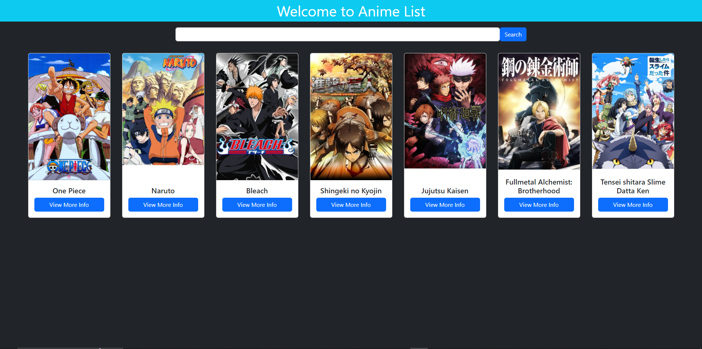

# SBA 308A JavaScript Web Application

This is my submision for the skill based assessment. Created an SPA which uses an API to fetch data. Users are able to search for anime and add them to their favorites list.

## Table of contents

- [Overview](#overview)
  - [The objectives](#the-objectives)
  - [Screenshot](#screenshot)
- [My process](#my-process)
  - [Built with](#built-with)
  - [Continued development](#continued-development)

## Overview

### The objectives

- Use asynchronous JavaScript tools to build a responsive web application.
- Demonstrate understanding of the JavaScript event loop.
- Generate asynchronous code using Promises and async/await syntax.
- Use fetch and/or Axios to interact with an external web API.
- Organize files using modules and imports.

### Screenshot

## My process

### Built with

- HTML
- JavaScript
- [BootStrap](https://getbootstrap.com/) - CSS library
- [JikanAPi](https://jikan.moe/) - Anime Api

### Continued development

- I want to add the capability for multiple lists
- The ability to remove anime from your list
